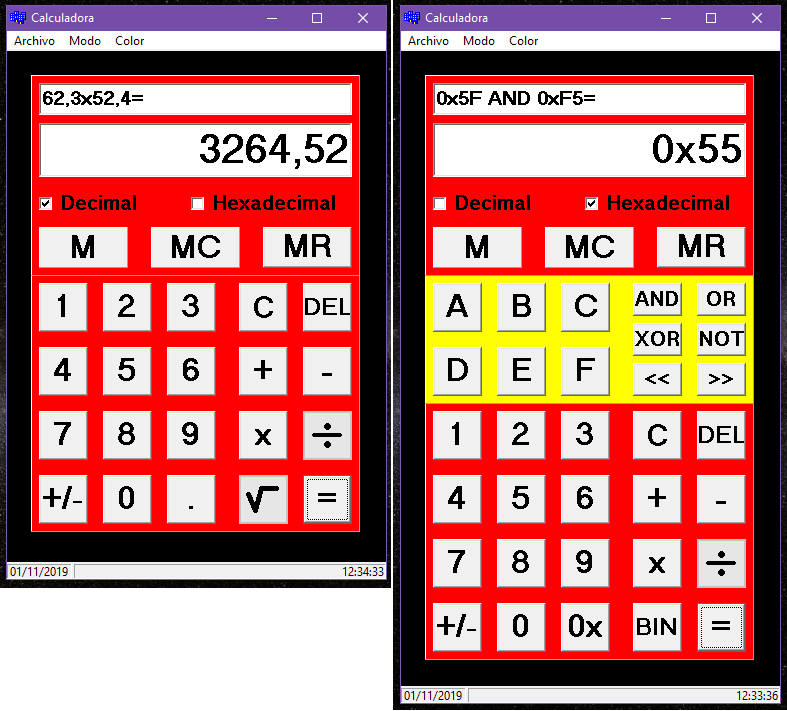

This proyect was born from a practices in a computerscience course.![/n]
It's a basic calculator and a calculator to operate with numbers in hexadecimal.
This proyect is created in the program Borland C++ Builder 6.

